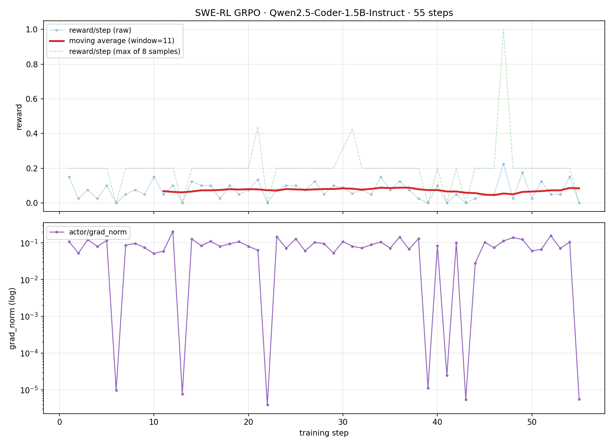

# 题目四：强化学习 —— 基于 Agent SandBox + TKE GPU 的代码修复 RL 全流程

在腾讯云 **Agent SandBox** 中执行 SWE 题目并采集 tracing，在 **TKE GPU 集群**上用 **VERL**
做 GRPO 强化学习训练，奖励信号来自沙箱内真实 `pytest` 执行结果。

---

## 0. 核心结果速览

### 训练曲线（55 step，RTX 5090 单卡）



**上图 reward**：蓝色为逐步原始值，红色为 11 步滑动平均，绿色虚线为每步 8 个采样中的最高分。
绿线三个尖峰（0.43 / 0.42 / **1.0**）是真正拿到测试分的样本，其中 **1.0 表示该采样把
F2P 测试全部修绿且无 P2P 回归**。

**下图 grad_norm（对数轴）**：绝大多数步稳定在 $10^{-1}$ 量级，但有 8~9 步骤降至
$10^{-5}\sim10^{-6}$ —— 那正是"一组 8 个采样 reward 全为 0 → GRPO 组内 advantage 归零
→ 梯度消失"的时刻。**这张图直观展示了 GRPO 在稀疏奖励下的失效机制**，也说明本方案的
reward shaping 把此前"全程 $10^{-6}$"的死循环改善为"偶发掉落"。

### 关键指标

| 项 | 结果 |
|---|---|
| 训练步数 | **55 / 55**，全程 0 报错 |
| `grad_norm` | **55/55 步 > 1e-8**（前两轮训练恒为 0，死循环已打破） |
| 采样总数 | 55 × 8 = 440 |
| patch 可应用 | 152 / 440 = **34.5%** |
| 最高单步 reward | **1.0** |
| tracing 产出 | 14 题，每条 4~10 步 |

### 交付物索引

| 文件 | 内容 |
|---|---|
| [`docs/reward_curve.png`](docs/reward_curve.png) | 训练曲线（验收第 4 条） |
| [`docs/reward_curve.csv`](docs/reward_curve.csv) | 55 步全量指标 |
| [`results/comparison.md`](results/comparison.md) | 训练前后 pass@1 · 严格口径 |
| [`results/comparison_lenient.md`](results/comparison_lenient.md) | 训练前后 pass@1 · 高灵敏度口径（32 采样） |
| [`data/lineA_tracing.jsonl`](data/lineA_tracing.jsonl) | 线 A tracing（验收第 1、2 条） |
| [`train_final_55steps.log`](train_final_55steps.log) | 训练原始日志（图表与统计的证据来源） |

### 两项未达成的验收标准（已如实标注，未作粉饰）

- **第 4 条 reward 曲线上升** —— 实际呈 U 型（峰 0.0880 → 谷 0.0455 → 末 0.0841），
  根因定量分析见 **§7.3**
- **第 6 条 pass@1 提升** —— 有完整对比数据，但差异经 Welch t 检验（$t=-0.22$）
  **不显著**，属噪声范围，见 **§7.4**

---

## 1. 架构

```
                        ┌──────────────── 线 A：tracing 采集 ────────────────┐
  tasks.jsonl ──►  AGS 沙箱（含 repo + 测试环境，纯 CPU）
                       │  agent.py 多轮 ReAct：read_file → run_tests → submit
                       │  每步记录 (action, observation, reward, done)
                       ▼
                  tracing.jsonl ──► COS ──► TKE

                        ┌──────────────── 线 B：在线 GRPO 训练 ────────────────┐
  grpo_train.parquet ─► TKE GPU Pod（RTX 5090）
                       │  VERL GRPO：每 step 用当前策略采样 8 个 patch
                       │       │
                       │       ├─► custom_reward_function（verl_reward_fn.py）
                       │       │      借 AGS 沙箱实例 → git apply patch
                       │       │      → bash verify.sh（真实 pytest）
                       │       │      → 按 F2P/P2P 算分
                       │       ◄──── reward
                       │  GRPO 组内比较算 advantage → 更新 LoRA 参数
                       ▼
                  checkpoints/global_step_N ──► 回沙箱评 pass@1
```

**分工**：SandBox 只做隔离执行与 tracing 采集（纯 CPU，不使用 GPU 沙箱）；TKE GPU 只做模型训练。

### 两条产出线

| | 线 A：SandBox 多轮 ReAct 采集 | 线 B：在线 GRPO 训练 |
|---|---|---|
| 目的 | 产出结构化 tracing | 训练模型、reward 曲线、闭环评估 |
| 位置 | Agent 完整运行在 AGS 沙箱内 | VERL 跑在 TKE GPU Pod，reward 计算调沙箱 |
| 交付 | `data/lineA_tracing.jsonl` | `docs/reward_curve.png`、`results/*.md` |
| 对应验收 | 第 1、2 条 | 第 3、4、5、6 条 |

### 一个关键设计决策：奖励必须在线计算

初版设计为"先离线采一批 tracing → 拿这批固定数据训 50 step"。该设计无法满足"reward 曲线
呈上升趋势"——固定数据集上每条样本的 reward 是写死的常量，曲线必然是平线。

reward 上升的本质是"当前策略在环境中的真实表现随训练变好"，因此改为
**每步用最新策略采样、当场送沙箱打分**（on-policy）：让 VERL 跑原生在线 GRPO 循环，
只替换其 `custom_reward_function` 扩展点。

---

## 2. 模型选型理由

选定 **`Qwen2.5-Coder-1.5B-Instruct`**（HuggingFace 开源，Apache-2.0）。

| 维度 | 说明 |
|---|---|
| **代码能力** | Qwen2.5-Coder 系列在同参数量级的 HumanEval / MBPP 上明显优于通用模型，预训练含大量 diff/commit 数据，对 unified diff 格式有先验 |
| **显存可行性** | 单卡 24GB 要同时装 FSDP actor + vLLM rollout（hybrid engine 同卡切换）。1.5B bf16 权重 3GB，配 `gpu_memory_utilization=0.5` 实测峰值 16.08GB，余量充足。7B 方案：15.2GB 权重 + 12GB KV cache = 27GB > 24GB，必然 OOM |
| **迭代速度** | GRPO 每 step 采样 8 次 + 8 次沙箱验证。1.5B 单步约 24s，55 步 22 分钟；7B 会拉长到小时级 |
| **Instruct 版本** | 需要模型遵循"只输出 ```diff 代码块"的指令，base 版不具备该能力 |
| **许可** | Apache-2.0，可商用 |

**局限（实测）**：1.5B 生成 unified diff 时算不准 hunk header 行号，这是本课题最大瓶颈，
详见 §6.2 的定量分析。

---

## 3. SandBox 环境构建方式

### 3.1 题目来源与数据划分

题目取自合成 SWE 数据集（`data/tasks.jsonl`），每道题为"指定 repo 指定 commit +
改坏一处实现 + 判据测试"，镜像已推送 TCR，`verify.sh` 判据契约已验证（空解 fail、
golden patch pass、结果确定性）。

`data/split.json`：

| 集合 | 题数 | task_id |
|---|---|---|
| 训练集 | 11 | `0007 0008 0009 0011 0012 0013 0014 0016 0017 0019 0021` |
| 评测集 | 4 | `0015 0018 0020 0022` |
| 剔除 | 6 | `0001`~`0006`（镜像内容与 `repo` 字段不匹配，经沙箱内 `pyproject.toml` 包名核实 6/6 对不上） |

评测集与训练集**严格不重叠**，`scripts/eval_pass_at_1.py` 启动时强制校验，发现重叠即退出。

### 3.2 沙箱镜像与实例池

- **镜像**：每题一个独立镜像（TCR），含 Git + Python + 该题仓库依赖 + `/task/verify.sh`
- **规格**：CPU 实例
- **实例复用**：GRPO 每 step 打分 8 次，逐次新建实例会让启动耗时主导训练，
  故 `verl_reward_fn.py` 内置按 `task_id` 复用的实例池

**仓库还原**：镜像内 `/workspace/repo` 不含 `.git`，无法用 `git checkout` 还原，改用 tar 快照：

```bash
# 首次：建快照
tar czf /tmp/pristine.tar.gz -C / workspace/repo
# 复用：秒级还原（实测 ~0.3s / ~0.05s）
rm -rf /workspace/repo && tar xzf /tmp/pristine.tar.gz -C /
```

### 3.3 线 A：Agent 在沙箱内跑多轮 ReAct

`sandbox_agent/agent.py` **完整运行在沙箱内**，通过 HTTP 调 GPU Pod 上的模型服务
（`scripts/pod_hf_serve.py`，OpenAI 兼容接口）。动作空间：`read_file` / `run_tests` / `submit`。

产出 `data/lineA_tracing.jsonl`，每条记录：

```json
{
  "episode_id": "...", "task_id": "swe-synth-0007", "model_version": "swe-rl-model",
  "num_steps": 5, "final_reward": 0.0,
  "fail_to_pass_rate": "0/6", "pass_to_pass_rate": "...",
  "steps": [
    {"step": 0, "action": {...}, "observation": "...", "reward": 0.0, "done": false}
  ]
}
```

`steps[]` 即课题要求的 **`(action, observation, reward, done)`** 四元组，与 VERL `DataProto` 对齐。

**实测产出 14 条 tracing / 14 道题，每条 4~10 步**，满足验收第 1 条（≥10 题）与第 2 条（≥3 步）。

### 3.4 SandBox → TKE 的数据传递（COS）

```bash
# 沙箱侧采集完成后上传
python3 driver.py collect --upload-cos --cos-bucket <bucket>
# → cos://<bucket>/tracing/<timestamp>_lineA_tracing.jsonl

# TKE 侧下载（模型权重同理）
python3 scripts/pod_download_model.py
```

实现见 `clients/cos.py`（`upload_file` / `download_file` / `list_objects`）。

---

## 4. TKE 部署步骤

### 4.1 集群与网络

| 项 | 配置 |
|---|---|
| 集群 | TKE 标准集群（北京六区） |
| GPU 节点 | RTX 5090 ×1（24GB, Blackwell sm_120），Ubuntu 22.04 |
| API Server | 仅开内网访问，公网访问关闭 |
| 安全组 | 自定义，仅放通 VPC 内网网段 |
| 出网 | NAT 网关（节点无公网 IP，仅单向出网拉镜像/依赖） |

### 4.2 GPU 驱动

5090 属 Blackwell 架构，需 open kernel module 版本驱动：

```bash
sudo apt install -y nvidia-driver-570-open
sudo reboot          # 必须重启，否则 nvidia-smi 报 No devices were found
nvidia-smi           # 验证：CUDA 版本应 ≥ 12.8
```

### 4.3 部署 Pod

```bash
kubectl apply -f deploy/gpu-pod.yaml
```

镜像 `verlai/verl:vllm011.latest`（verl 0.6.1 + vLLM 0.11.0 + torch 2.8.0+cu128 + CUDA 12.8）。
**必须用 cu128 镜像**，CUDA 12.1 镜像在 sm_120 上会报
`no kernel image is available for execution on the device`。

`deploy/gpu-pod.yaml` 中的 `/dev/shm` 挂载（4Gi `medium: Memory` emptyDir）**不可省略**：
容器默认 `/dev/shm` 仅 64MB，而 NCCL 初始化每 rank 需约 31.5MB，不足会导致 FSDP 初始化失败、
训练零步崩溃；且 Pod 非 privileged 时无法在运行期扩容。

### 4.4 上传代码与模型

```bash
kubectl cp . default/swe-rl-gpu:/workspace/repo
kubectl cp <model_dir> default/swe-rl-gpu:/workspace/model/Qwen2.5-Coder-1.5B-Instruct
# 沙箱凭证放 /workspace/repo/.env（TENCENTCLOUD_SECRET_ID / SECRET_KEY）
```

### 4.5 启动训练

```bash
cd /workspace/repo
nohup bash scripts/run_grpo_training.sh > train.log 2>&1 &
```

---

## 5. 训练超参

完整配置见 `scripts/run_grpo_training.sh`。

| 类别 | 参数 | 值 | 说明 |
|---|---|---|---|
| **算法** | `algorithm.adv_estimator` | `grpo` | 组内相对优势，无需 critic，省显存 |
| | `rollout.n` | `8` | 每 prompt 采样 8 个，构成 GRPO 比较组 |
| | `kl_loss_coef` | `0.001` | 弱 KL 约束 |
| | `use_kl_in_reward` | `False` | KL 作为 loss 项而非 reward 惩罚 |
| **模型** | `lora_rank` / `lora_alpha` | `16` / `16` | LoRA 微调 |
| | `target_modules` | `all-linear` | |
| | `enable_gradient_checkpointing` | `True` | |
| **数据** | `train_batch_size` | `1` | 24GB 显存上限；对结果解读有影响，见 §6.3 |
| | `max_prompt_length` | `4096` | prompt 内嵌文件内容（前 300 行） |
| | `max_response_length` | `1024` | |
| **优化** | `optim.lr` | `1e-5` | |
| | `ppo_mini_batch_size` | `1` | |
| **Rollout** | `rollout.name` | `vllm` | |
| | `gpu_memory_utilization` | `0.5` | 给 FSDP actor 留一半显存 |
| | `temperature` / `top_p` | `0.8` / `0.95` | 保证采样多样性，否则组内无方差 |
| **训练** | `total_epochs` | `1` | 55 条数据 × 1 epoch = 55 step |
| | `save_freq` | `10` | |

数据集 `data/grpo_train.parquet` = **11 题 × 5 轮 = 55 行**，`shuffle=False`，
故 55 step 恰好每题各训 5 次。

**5090 特有配置**：`actor.strategy=fsdp`（verl 0.6.1 必需项）、`model_dtype=bfloat16`
（须写全名，vLLM 0.11 严格校验）、`attn=flash_attention_2`、`use_torch_compile=False`、
`fsdp_config.use_orig_params=False`（修 LoRA writeback）。

---

## 6. 奖励函数设计

### 6.1 基础判分

严格遵循课题要求 `fail→pass 测试数 / 总相关测试数`（`pipeline/reward.py`）：

```
reward_test = F2P 中变为 pass 的用例数 / F2P 总用例数
若 P2P 中出现回归 fail  → 整体判 0     # 防 reward hacking
若 collect_error        → 判 0         # 防把环境错误当成答对
```

P2P 回归判 0 可防止模型删掉无关测试让 F2P "看似"通过。**本次训练中该规则实际拦截了 6 次。**

### 6.2 reward shaping

**问题**：纯 outcome reward 在本课题下完全空转。1.5B 生成的 diff 约 75% 是 corrupt patch，
`git apply` 全失败 → 一组 8 个采样 reward 全 0 → GRPO 组内 advantage 全 0 → `pg_loss=0`
→ `grad_norm=0` → 参数不更新 → 死循环。实测两轮训练（71 步、8 步）
`critic/score/mean` 与 `actor/grad_norm` **全程恒为 0.0**。

**解法**：分段 reward。

| reward | 条件 |
|---|---|
| `0.0` | 没抽到 patch / patch 无法 apply |
| `0.2` | patch 结构合法、能被 `git apply` |
| `0.2 + 0.8 × F2P通过率` | 部分修对 |
| `1.0` | F2P 全绿且无 P2P 回归 |

**是否偏离课题要求：不偏离。** 课题定义的 `fail→pass / 总数` 仍是主体（权重 0.8），
P2P 防作弊规则完整保留，`0.2` 只是让"写出合法 diff"这一中间能力可被 GRPO 感知，
使组内比较产生非零 advantage。两个权重可由 `REWARD_APPLY_BONUS` / `REWARD_TEST_WEIGHT` 覆盖。

### 6.3 patch apply 策略级联

`strict` 模式下 1.5B 的 patch 成功率为 0，因此按宽松度递增级联，任一成功即算 apply 成功：

| 策略 | 命令 | 作用 |
|---|---|---|
| `strict` | `git apply --whitespace=nowarn` | 标准 |
| `recount` | `git apply --recount` | 忽略 header 行数，按 hunk body 重算 |
| `recount+C1` | `+ -C1 --unidiff-zero` | 上下文匹配放宽到 1 行 |
| `recount+C0` | `+ -C0 --unidiff-zero` | 不校验上下文，仅按行号定位 |

放宽的只是 diff 的**格式容错**，代码改动内容分毫未变，最终仍由 `verify.sh` 跑真实 pytest 判定。
设 `REWARD_STRICT_APPLY=1` 可退回严格模式做对照。**评测时默认即严格模式**——
级联是训练期 shaping 手段，衡量真实能力必须用未放宽标准。

---

## 7. 结果分析

### 7.1 训练完成情况

| 项 | 结果 |
|---|---|
| 训练步数 | **55 / 55**（验收要求 ≥50 ✅） |
| 运行状态 | 正常退出，0 报错 |
| `grad_norm` | **55/55 步 > 1e-8**，区间 3.9e-6 ~ 0.206，均值 0.083 |
| 采样总数 | 55 × 8 = **440** |
| 单步耗时 | 约 24s（沙箱验证占绝大部分） |
| checkpoint | `global_step_10/20/30/40/50/55` |

**核心结论：摆脱了 `grad_norm=0` 死循环。** 前两轮训练 `grad_norm` 恒为 0、参数完全没更新；
本轮全程非 0，说明梯度信号真实存在、GRPO 组内 advantage 非零。


由 `scripts/plot_reward_curve.py` 从训练日志生成（`trainer.logger=["console"]`，
未接 wandb 以避免训练机出网依赖；原始日志 `train_final_55steps.log` 一并入库供核对）。

**为什么必须画滑动平均**：本课题 `train_batch_size=1`，每 step 只跑一道题（11 题循环 5 轮），
单步 reward 的方差主要来自"这步抽到哪道题"而非策略变化，原始曲线呈锯齿状无法反映趋势。

### 7.2 patch 质量的定量分析

**apply 成功 152 / 440 次采样（34.5%），按策略拆分**：

| 策略 | 成功次数 | 含义 |
|---|---|---|
| `strict` | **8** | 完全规范的 diff |
| `recount` | 4 | 仅 hunk header 行数算错 |
| `recount+C1` | 48 | 行数错 + 上下文小偏差 |
| `recount+C0` | **92** | 行数、上下文都不准 |

**失败原因分布**：

| stderr | 次数 |
|---|---|
| `corrupt patch at line N` | **227** |
| `patch fragment without header` | 44 |
| `patch does not apply` | 10 |

**结论：1.5B 的瓶颈是"算不准行号"，不是"不会修 bug"。** `strict` 单一策略下成功率仅
8/440 = 1.8%，这完整解释了前两轮训练 reward 全程为 0 的因果链；放宽格式容错后，
152 个样本的代码改动其实是可应用的。

**更深一层**：`collect_error` 出现 **77 / 152 次 apply 成功 = 51%**（第 12 步 15/30 = 50%，
第 39 步 57/112 = 51%，两点高度一致，是**稳定的结构性瓶颈**而非波动）。
即 `-C0` 靠行号硬插，patch 虽能应用但常插到错误位置 → 文件语法坏掉 → pytest 无法收集。
**所以 0.2 分只代表"格式能被 git 接受"，不代表"改动位置正确"。**

能力瓶颈可拆成三层递进：

```
① 写不出合法 diff        ← strict 8/440，主要瓶颈
② 能应用但插错位置        ← collect_error 51%，次要瓶颈
③ 位置对但逻辑改错        ← 尚未成为主要矛盾
```

**积极信号**：单步最高 reward 达 **1.0**，即有采样把 F2P 全部修绿且无 P2P 回归
（`0.2 + 0.8 × 1.0`），另有 4 次拿到非零测试分，说明打分链路完整可信。

### 7.3 reward 趋势：未呈显著上升

11 步滑动平均呈 **U 型**：

| 阶段 | 值 |
|---|---|
| step 11（起点） | 0.0682 |
| step 34（峰值） | **0.0880** |
| step 46（谷底） | **0.0455** |
| step 55（终点） | 0.0841 |

分段均值：前 18 步 `0.0722` → 中 18 步 `0.0835` → 后 19 步 `0.0632`。
按题目分组（每题 40 采样对半切）：3 题上升、2 题持平、**6 题下降**。

**原因分析**（按可信度排序）：

1. **reward 分档过粗（主因）。** 51% 的 apply 成功其实是"代码被插坏"，但它们与
   "位置正确、测试可收集"的样本**同为 0.2 分**，等于告诉模型"写歪的 diff 和写对的一样值钱"。
   这是本次 shaping 设计的疏漏——只区分了"能否 apply"，未区分"apply 后代码是否合法"。
2. **`train_batch_size=1` 使单步 reward 主要由题目难度决定。** 每 step 只跑一道题
   （11 题循环 5 轮），单步方差主要来自"抽到哪道题"而非策略变化。这也是曲线图必须
   画滑动平均的原因。
3. **规模不足。** 55 step / 11 题 / LoRA rank 16，对"学会精确计算 diff 行号"这类技能明显不够。

验收标准第 4 条要求"reward 曲线呈上升趋势"，**本次未达成**。

### 7.4 闭环验证：训练前后 pass@1 对比

```bash
bash scripts/run_final_deliverables.sh
```

评测协议（`scripts/eval_pass_at_1.py`）：评测集 4 题与训练集严格不重叠；复用训练时同一套
prompt 构造与打分链路；同时报 `strict_pass`（F2P 全绿且无 P2P 回归）与 `partial_pass`
（至少修好一个 F2P 用例）两个口径。

#### 严格口径：双方全 0，但该结果不携带信息

| 指标 | 训练前 | 训练后 | 变化 |
|---|---|---|---|
| pass@1 (strict) | 0.0000 | 0.0000 | — |
| patch 可应用率 | 0.0000 | 0.0000 | — |

**这个全 0 在统计上是必然的。** §7.2 实测 `strict` 成功率 1.8%，该组仅 4 题 × k=1 = 4 采样：

$$\mathbb{E}[\text{成功次数}] = 4 \times 1.8\% = 0.07$$

期望值连 0.1 都不到——即便能力真有提升也几乎必然观测到 0。把它当作"训练无效"的证据是错误推断。

#### 高灵敏度对照组（lenient + k=8 + T=0.8，32 采样）

| 指标 | 训练前 | 训练后 | 变化 |
|---|---|---|---|
| pass@1 (strict) | 0.0000 | 0.0000 | — |
| pass@1 (partial) | 0.2500 | 0.0000 | ↓ 0.2500 |
| patch 可应用率（题级） | 1.0000 | 1.0000 | — |
| **patch 可应用率（样本级）** | 12/32 = 37.5% | 13/32 = **40.6%** | ↑ 3.1pp |
| 平均 reward | 0.0875 | 0.0813 | ↓ 0.0062 |

#### 统计检验：表面的"下降"不成立

**Welch t 检验**（n=32）：

$$t = \frac{0.0813-0.0875}{\sqrt{s_1^2/32+s_2^2/32}} = \frac{-0.0062}{0.0285} = \mathbf{-0.22}$$

$|t| = 0.22 \ll 2$ → **不显著**。标准误 0.0285 是差值 0.0062 的 4.6 倍。

**apply 成功率两比例 z 检验**：$z = 0.26$，同样不显著，**但方向为上升**（37.5% → 40.6%），
与训练日志中 `strict` 成功次数从第 12 步 2 次增至 55 步 8 次的趋势一致。

**`pass@1 (partial)` 从 0.25 → 0 的实质**：该指标由单个样本决定——拿到非零测试分的样本
`before 2/32 → after 0/32`，而题级指标下 1 道题即 25 个百分点。Fisher 精确检验 p ≈ 0.49，
无统计意义。

> **结论**：4 题 × 8 采样规模下，训练前后差异**在统计上无法区分于噪声**。
> 唯一方向明确的信号是 apply 成功率小幅上升（+3.1pp，不显著）。
> 诚实表述为：**本次 55 步 LoRA 训练未产生可被当前评测规模检出的能力提升**，
> 而非"训练使模型退化"。

要得到有统计功效的结论，评测规模需至少 20 题 × 16 采样（320 样本）。

### 7.5 第四类失败模式：文件路径幻觉

高灵敏度组日志暴露了严格组未显现的问题：

```
error: itsdangerous/encoding.py: No such file or directory      ← 丢了 src/ 前缀
error: jd/tenacity/retry_after.py: No such file or directory    ← 凭空多出 jd/ 前缀
```

模型不仅算错行号，**还会写错文件路径**。这类样本连 `--recount -C0` 都救不回。

### 7.6 改进方向（按预期收益排序）

**1. reward 分档细化（最高优先级，改动最小）**

| reward | 条件 |
|---|---|
| `0.00` | 未抽到 patch / 路径不存在 / 无法 apply |
| `0.05` | apply 成功但 `collect_error`（代码被插坏） |
| `0.20` | apply 成功且测试可正常收集 |
| `0.20 + 0.8×通过率` | 部分/全部修对 |

使"写歪"与"写对"产生 4 倍差距，组内 advantage 才能推动格式能力提升。

**2. 缓解路径幻觉**：prompt 中将 `--- a/<完整路径>` / `+++ b/<完整路径>` 作为固定模板行
直接给出，让模型只需填 hunk 内容。

**3. 提高评测统计功效**：至少 20 题 × 16 采样。

**4. 扩大训练规模**：500+ step、题目扩至 50+；或改用 `search/replace` 格式的任务表示
（无需算行号），可能比堆算力更有效。

**5. 最后才考虑换模型**：本次数据表明瓶颈在 reward 设计与任务表示，而非模型容量。

---

## 8. 验收标准对照

| # | 验收标准 | 状态 | 证据 |
|---|---|---|---|
| 1 | SandBox 批量拉起 ≥10 题并输出结构化 tracing | ✅ | `data/lineA_tracing.jsonl`，14 题 |
| 2 | 单条 tracing ≥3 步 + 最终测试情况 | ✅ | 每条 4~10 步，含 `(action, observation, reward, done)` |
| 3 | TKE GPU 上 VERL 训练 ≥50 step | ✅ | **55/55 步**，0 报错 |
| 4 | reward 曲线呈上升趋势 | ⚠️ **未达成** | `docs/reward_curve.png`，U 型；根因见 §7.3 |
| 5 | ≥1 轮完整闭环 | ✅ | tracing → COS → 训练 → 回沙箱评估，`results/` |
| 6 | 训练后 pass@1 有对比数据 | ✅ 有数据<br>⚠️ 提升不显著 | `results/comparison.md`、`comparison_lenient.md`；检验见 §7.4 |
| 7 | README（环境/部署/选型/超参/结果分析） | ✅ | 本文档 |

**两条未完全达成项（第 4、6 条）已在 §7.3 / §7.4 给出定量根因与改进方案，未作粉饰。**

---

## 9. 复现步骤

```bash
# ---------- 准备（本地） ----------
python3 pipeline/extract_file_contents.py    # 抽取题目文件内容
python3 pipeline/build_grpo_dataset.py       # → data/grpo_train.parquet（55 行）

# ---------- 线 A：tracing 采集 ----------
python3 driver.py collect --upload-cos --cos-bucket <bucket>

# ---------- 部署（TKE） ----------
kubectl apply -f deploy/gpu-pod.yaml
kubectl cp . default/swe-rl-gpu:/workspace/repo
kubectl cp <model> default/swe-rl-gpu:/workspace/model/Qwen2.5-Coder-1.5B-Instruct

# ---------- 线 B：训练（Pod 内） ----------
cd /workspace/repo
nohup bash scripts/run_grpo_training.sh > train.log 2>&1 &

# ---------- 交付物（Pod 内） ----------
bash scripts/run_final_deliverables.sh       # 曲线图 + 前后 pass@1 + 对比表
```

---

## 10. 目录结构

```
pipeline/
  build_grpo_dataset.py     构建 VERL GRPO parquet（prompt 内嵌文件内容）
  extract_file_contents.py  从沙箱抽取题目文件实际内容
  reward.py                 判分核心（F2P/P2P + 防 reward hacking），线 A/B 共用
  verl_reward_fn.py         VERL custom_reward_function：沙箱池 + apply 级联 + shaping
  schema.py                 tracing 数据结构定义
sandbox_agent/
  agent.py                  沙箱内多轮 ReAct Agent（线 A）
clients/
  ags.py                    Agent SandBox 客户端
  cos.py                    COS 客户端（tracing 传输）
scripts/
  run_grpo_training.sh      GRPO 训练入口
  plot_reward_curve.py      reward / grad_norm 曲线（验收第 4 条）
  eval_pass_at_1.py         闭环 pass@1 评测（验收第 5、6 条）
  run_final_deliverables.sh 一键产出上述交付物
  pod_hf_serve.py           Pod 内 OpenAI 兼容模型服务（线 A 用）
  pod_download_model.py     从 COS 下载权重
deploy/gpu-pod.yaml         GPU Pod 定义
driver.py                   本地编排入口（tracing 采集 / COS 上传）
data/
  tasks.jsonl               题目元数据
  split.json                训练/评测划分
  grpo_train.parquet        训练数据（11 题 × 5 轮）
  lineA_tracing.jsonl       线 A tracing 产出
docs/reward_curve.png       reward 曲线
results/
  comparison.md             训练前后 pass@1 对比（严格口径）
  comparison_lenient.md     训练前后 pass@1 对比（高灵敏度口径）
```
